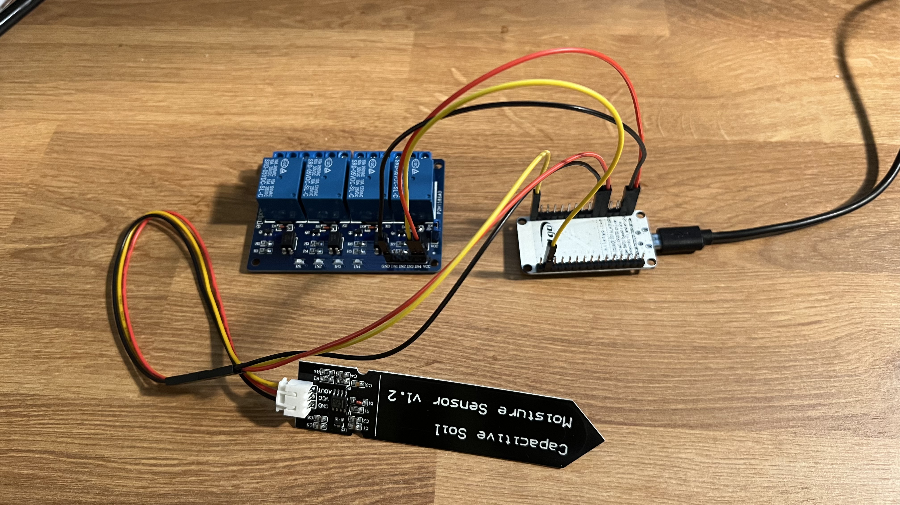
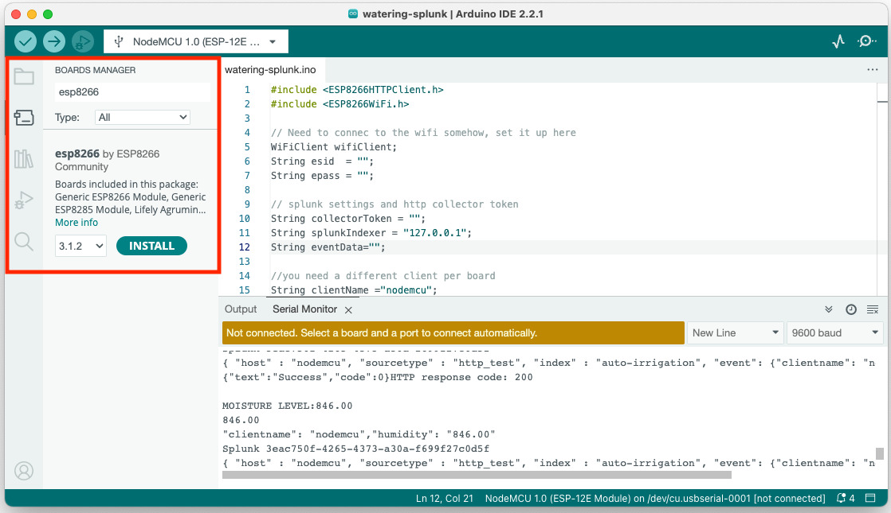
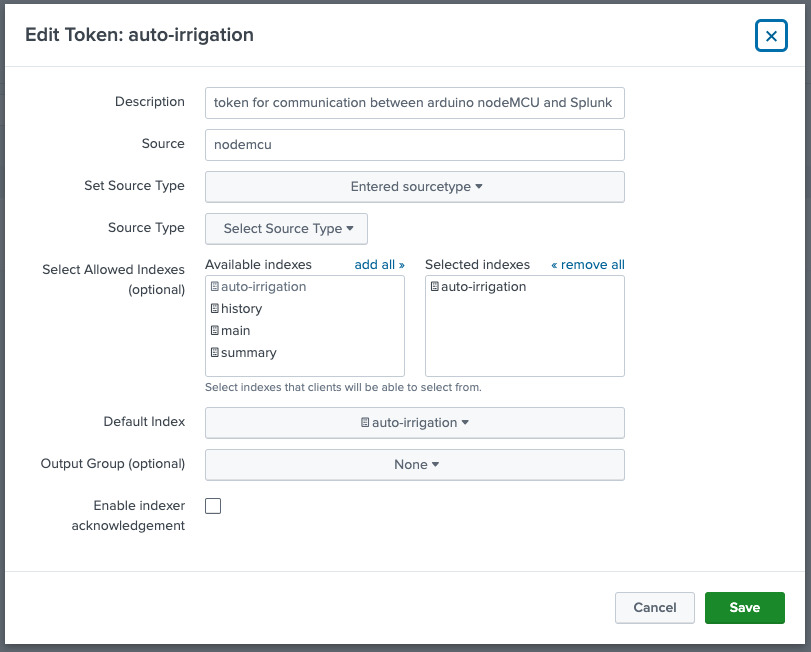
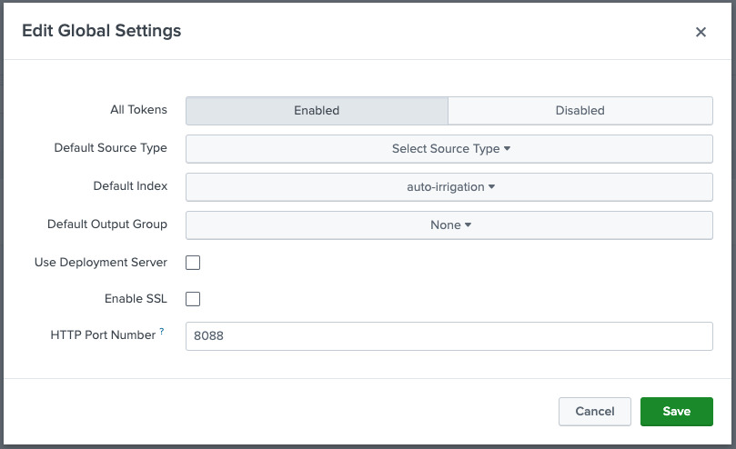
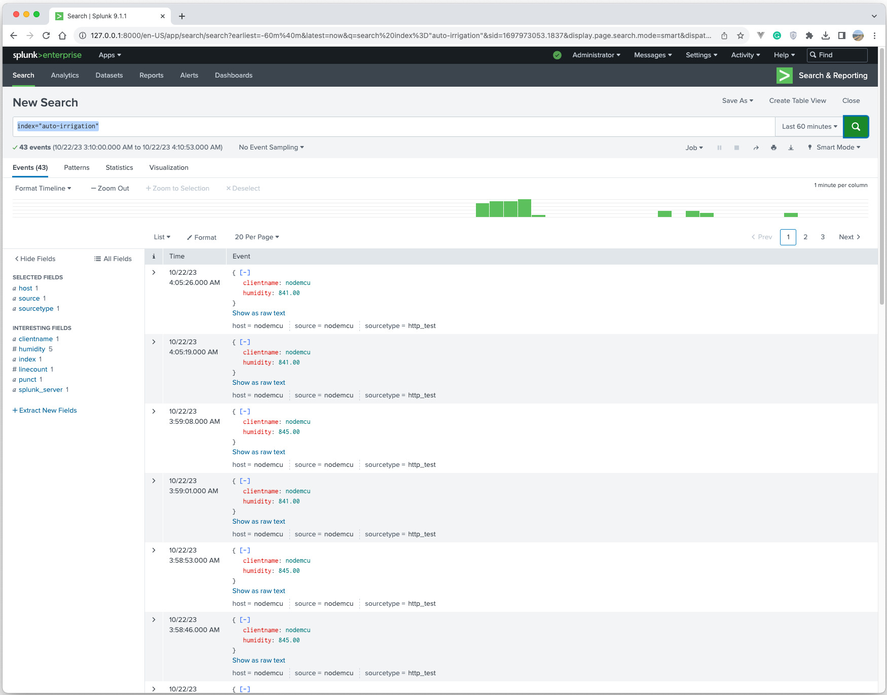

# How to send Arduino data to Splunk

This document provides a step-by-step tutorial on how to send soil moisture data generated by Arduino to Splunk. Please note that the tutorial applies in **macOS** only and the following Arduino modules are required.

* ESP8266 NodeMCU([amazon](https://www.amazon.com/gp/product/B081CSJV2V/ref=ppx_yo_dt_b_asin_title_o01_s00?ie=UTF8&th=1))
* 5V Relay Module and Soil Moisture Sensor([amazon](https://www.amazon.com/gp/product/B07TMVNTDK/ref=ppx_yo_dt_b_asin_title_o07_s00?ie=UTF8&psc=1))
* Multicolored Dupont Wire([amazon](https://www.amazon.com/gp/product/B01EV70C78/ref=ppx_yo_dt_b_asin_title_o05_s00?ie=UTF8&psc=1))

This tutorial consists of four parts.

1. Set up Arduino components
2. Set up Arduino IDE
3. Set up Splunk on your laptop
4. Send data from Arduino to Splunk

## 1. Set up Arduino components

For simplicity, we only need a moisture sensor, a nodeMCU module, and a relay module.

> It is required to connect a motor pump with a relay module in the end. We will update this page with the motor pump connection tutorial later.

### How to connect

* NodeMCU <-----> Soil Moisture Sensor
  - GND <-----> GND
  - 3V3 <-----> VCC
  - A0 <-----> AOUT
* NodeMCU <-----> 5V Relay Module
  - GND <-----> GND
  - Vin <-----> VCC
  - D1 <-----> IN4

Plese refer to the ESP8266 NodeMCU kit pinout diagram below to find the right pin to connect.

The outcome of connected Arduino components look like below.

## 2. Set up Arduino IDE

1. Download & install the Arduino IDE([official website](https://www.arduino.cc/en/software))
2. Open code
   - Go to **File** > **Open...** > choose "watering-splunk.ino** 
3. Get the ESP board manager extension
   - Go to **Arduino IDE** Menu > **Preferences** > **Settings**
   - Enter `http://arduino.esp8266.com/stable/package_esp8266com_index.json` in **Additional board manager URLs**
4. Download the library for ESP8266
   - Go to **Tools** > **Board** > **Board Manager...** > Type "esp8266"
   - Install the **esp8266** library written by ESP8266 Community
   - 
5. Set up cofigurations to run your code on the ESP8266 nodeMCU
   - Select **Tools** > **Board** > **esp8266** > **NodeMCU 1.0 (ESP-12E Module)**
   - Select **Tools** > **Flash Size** > **4MB (FS:3MB OTA:~512KB)**
   - Select **Tools** > **CPU Frequency** > **80 MHz**
   - Select **Tools** > **Upload Speed** -> **921600**
   - Select **Tools** > **Port** > **/dev/cu.usbserial-0001** (whatever port that pops up when your ESP8266 nodeMCU is connected to your laptop)

## 3. Set up Splunk on your laptop

1. Go to the [Splunk official website](https://www.splunk.com/en_us/download.html), download, and install Splunk Enterprise.
   - Please refer to [the useful YouTube instruction](https://www.youtube.com/watch?v=DTzhK5txpQ8)
   - **IMPORTANT**: You need to set up **SPLUNK_HOME** environment variable on your machine. Run the below command on your CLI.
     > `echo export 'SPLUNK_HOME="<directory path where your splunk file is located>"' >> ~/.zshrc`
   - To start Splunk, run `$SPLUNK_HOME/bin/splunk start`
2. Create a HTTP Event Collector(HEC) token on Splunk Enterprise
   - Follow [the official instructions](https://docs.splunk.com/Documentation/Splunk/9.1.1/Data/UsetheHTTPEventCollector?ref=hk#Create_an_Event_Collector_token_on_Splunk_Enterprise)
   - **WARNING**: do not click the **Enable indexer acknowledgment** checkbox
   - Please take my token setting as reference
   - 
   - To use the token, go to **Settings** > **Data inputs** > **HTTP Event Collector** > **Actions** column > click **Enable**
   - Copy the token value to `collectorToken` var on line 10 in `watering-splunk.ino`
3. Enable HTTP Event Collector on Splunk Enterprise
   - Follow [the official instructions](https://docs.splunk.com/Documentation/Splunk/9.1.1/Data/UsetheHTTPEventCollector?ref=hk#Enable_HTTP_Event_Collector_on_Splunk_Enterprise)
   - Please take my token setting as reference
   - 

## 4. Send data from Arduino to Splunk

1. In the Arduino IDE sketch board
   - Type the correct wifi id and password on line 5 and 6
   - Make sure that you choose the correct **Board** and **Port**
   - Click the "check" button on the top left corner of thethe Arduino sketch board to verify the code
   - Click the "right arrow" button on the top left corner of the Arduino sketch board to upload  and run the code
   - Click the "Serial Monitor" button on the top right corner. Confirm that wifi connection is successfully established and HTTP response code marks 200.
   - 

2. In Splunk Enterprise
   - Click **splunk>enterprise** logo on the top left corner
   - Choose **Search & Reporting** on the left menu
   - Type `index="auto-irrigation"` in the search bar and hit enter
   - Confirm the log data is stored and retrieved in Splunk Enterprise
   - 

   
